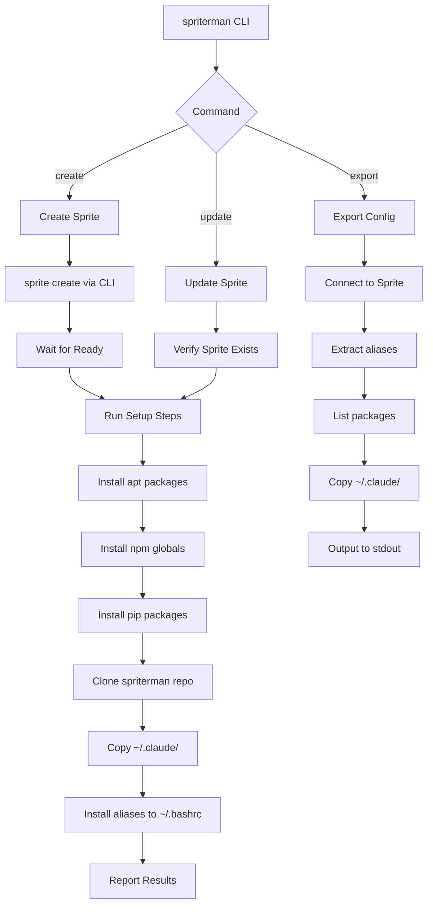

# Spriterman CLI Tool

A Bash CLI tool for creating and managing templated sprites on sprites.dev with pre-configured aliases, packages, and Claude Code settings.

## Overview

Spriterman automates the setup of new sprites with a consistent development environment. Instead of manually configuring each sprite, users run a single command that creates the sprite and applies their template configuration.

**Repository**: github.com/sandalsoft/spriterman

## Scope

### In Scope
- `spriterman create <name>` - Create sprite via `sprite` CLI and apply full template
- `spriterman update <name>` - Re-apply template to existing sprite (idempotent)
- `spriterman export <name>` - Extract current sprite config to stdout
- Config files: aliases.sh, packages.txt
- Claude Code config sync (~/.claude/ directory)

### Out of Scope (v1)
- Multiple template profiles
- Dotfiles management (user will add later)
- SSH key management
- Environment variable configuration
- GUI or TUI interface

## Architecture



## Approach

### CLI Framework
- Use `sprite` CLI (not raw API) - handles auth automatically
- Subcommand dispatch via `case` statement
- Error collection array pattern - continue on failure, report all at end
- Colored output with log levels (info, warn, error)
- Strict mode: `set -euo pipefail`

### Authentication
- Primary: Relies on `sprite` CLI auth (user runs `sprite login` first)
- Fallback: Check `$SPRITE_TOKEN` env var for direct API calls if needed
- No token storage in spriterman itself

### Idempotency Strategy (for update)
- apt: Use `dpkg -l | grep -q` before install
- npm: Use `npm list -g --depth=0` check
- pip: Use `pip show` check
- Aliases: Use `grep -qF` before appending to ~/.bashrc
- ~/.claude/: Overwrite (merge not worth complexity)

### Error Handling
- Exit codes: 0=success, 1=partial failure, 2=fatal, 3=config error
- Error array collects failures, reported at end
- Each step logs success/failure with colored output
- Non-zero exit only after all steps attempted

## Phases

### Phase 1: Foundation (Tasks 1-2)
- Project scaffolding with directory structure
- CLI framework with subcommand dispatch
- Create command implementation

### Phase 2: Complete Commands (Task 3)
- Update command with idempotency
- Export command with stdout output

### Phase 3: Finalization (Task 4)
- Claude config template
- End-to-end testing on real sprite
- Documentation updates

## Alternatives Considered

| Option | Pros | Cons | Decision |
|--------|------|------|----------|
| Raw API vs sprite CLI | More control, no CLI dependency | Complex auth, reinvent wheel | **Use sprite CLI** |
| Bash vs Python | No dependencies, runs anywhere | Less maintainable at scale | **Bash for v1** (simple enough) |
| Hardcoded config vs files | Simpler, single file | Can't customize without editing script | **Config files** |
| Template repo clone vs embed | Easy updates, git-native | Extra network call, versioning | **Clone to /tmp** |

## Non-Functional Requirements

- **Performance**: Create command < 60s (excluding package install time)
- **Reliability**: Partial failures don't block other steps
- **Usability**: Clear error messages, colored output
- **Portability**: Works on any system with bash 4+ and sprite CLI

## Risks and Mitigations

| Risk | Impact | Likelihood | Mitigation |
|------|--------|------------|------------|
| sprite CLI not installed | Fatal | Medium | Check on startup, clear error message |
| Sprites API changes | Breaking | Low | Use stable v1 endpoints only |
| Package install timeout | Partial failure | Medium | Continue with other steps, report |
| GitHub clone fails | No aliases/config | Low | Retry once, fall back to cached if exists |
| Large ~/.claude/ directory | Slow copy | Low | Use rsync for delta copies |

## Quick Commands

```bash
# Create a new templated sprite
spriterman create my-dev-sprite

# Update existing sprite with latest template
spriterman update my-dev-sprite

# Export sprite config to file
spriterman export my-dev-sprite > my-config.sh

# Verify sprite CLI is available
which sprite || echo "Install sprite CLI first - see https://docs.sprites.dev/cli/"
```

## Acceptance Criteria

- [ ] `spriterman create <name>` creates a sprite and applies full template
- [ ] `spriterman update <name>` re-applies template idempotently (no duplicate aliases)
- [ ] `spriterman export <name>` outputs usable config to stdout
- [ ] Partial failures don't prevent other steps from running
- [ ] All failures reported at end with clear messages
- [ ] README documents installation and usage
- [ ] Works on fresh sprite with sprite CLI installed

## Documentation Updates

- Create README.md with installation, usage, and configuration
- Add CONTRIBUTING.md (basic for now)
- Update CLAUDE.md with project-specific context

## References

- [Sprites API Docs](https://docs.sprites.dev/api/v001-rc30/)
- [sprite CLI Commands](https://docs.sprites.dev/cli/commands/)
- [Bash Strict Mode](https://redsymbol.net/articles/unofficial-bash-strict-mode/)
- Pattern: hedgedoc/cli for subcommand dispatch
- Pattern: jnsgruk/firecracker-ubuntu for colored logging
